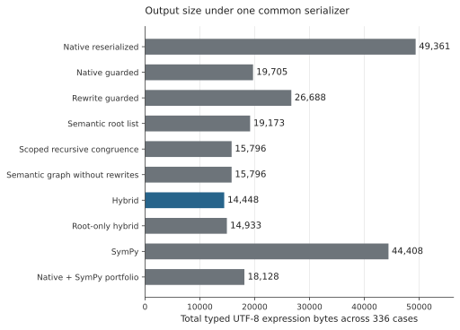
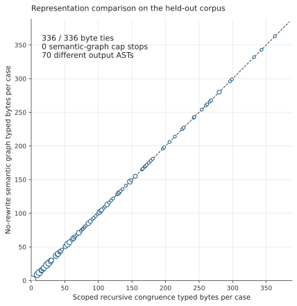
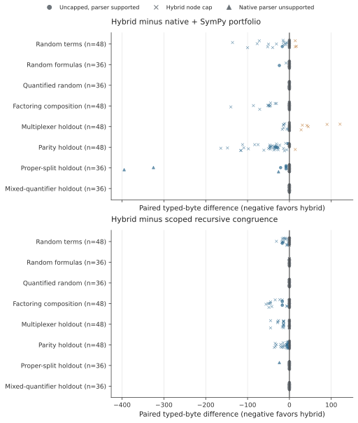
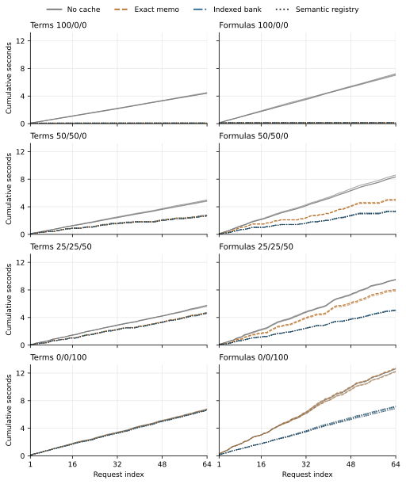

# Checked semantic saturation for a restricted atomless Boolean algebra fragment

Research manuscript draft, 4 October 2026

The complete quality, resource, and online reuse results are incorporated. [Scientific evidence checks](../audit/VALIDATION_STATUS.json), clean committed-checkout replay, content audit, and document inspection are complete at the scopes stated below. Publication identity and historical replay scope are distinguished below. The prospective freeze predates the confirmatory run; it is a local, hash-bound record rather than a public preregistration. No authorship or venue is assigned in this draft.

## Abstract

A semantic equality oracle can supply an optimizer with equivalences that are inconvenient to express as rewrite rules, but attributing its benefits requires strong composition and cache controls. This study develops a checked reference artifact for a restricted non-temporal Tau fragment. A Lean 4.29.1 theorem proves that exhaustive finite-support comparison is sound and complete over every nonempty atomless Boolean subalgebra of sets. The Python adapter and evaluator are connected by 1,073 development fixtures and 11,979 formula/support observations, rather than an end-to-end refinement theorem. Changed outputs require typed parse roundtrip, complete support comparison, and native checks in both directions. On a prospectively frozen 336-case synthetic holdout, a hybrid semantic/rewrite optimizer emits 14,448 typed bytes versus 19,705 for guarded native normalization and 18,128 for a native/SymPy portfolio; it loses to the portfolio on ten cases. Crucially, a no-rewrite semantic e-graph and full scoped recursive congruence tie byte cost on every case. Three native outputs exceed the adapter's parser grammar. An explicitly post-hoc sensitivity excluding them leaves 24.1% aggregate savings against guarded native and 17.1% against the portfolio, but only 45 bytes of savings across 105 parser-supported quantified inputs, where hybrid exactly ties root selection and recursive congruence in byte quality. The incremental search benefit is concentrated in pure terms. A verified cold-inclusive reuse campaign finds zero native-check savings beyond ordinary exact memoization, and no distinct benefit of the semantic memo over a signature-indexed fixed bank. These results support a precisely scoped checked-reference artifact and an empirical mechanism boundary, not a new generic semantic-e-graph architecture or compiler-speedup claim.

## 1 Introduction

This study asks when checked semantic equivalence is useful in an expression optimizer for a small Boolean-algebra fragment accepted by Tau. A proposal may come from native normalization, a fixed grammar bank, or algebraic rewrites. The optimizer is permitted to use such a proposal only within an explicit typed context and only under its check contract. It selects for emitted expression size, not execution speed, proof size, or a global optimum.

Three distinctions motivate the design. First, Boolean-algebra terms and Boolean-algebra formulas have different semantic requirements. Evaluating pure terms on Boolean corners is sufficient for term identities, but treating a quantified algebra element as a Boolean bit loses atomless witnesses. Second, a matched root list is a useful selection baseline but a weak composition baseline. An e-graph can beat that list simply by rebuilding parents from cheaper children. A full-alternative, scope-aware congruence table is therefore required before attributing a benefit to the representation. Third, a cache can avoid repeated native checks of exactly the same pair without allowing a certificate for new syntax. Cold construction and certificate costs must remain visible.

These are not new generic optimization ideas. E-class analyses and extraction are central to [egg](https://doi.org/10.1145/3434304); semantic identifiers drive merging in [Nextmap](https://doi.org/10.1145/3808299); and [Omelets Need Onions](https://arxiv.org/html/2504.14340v1) discusses theory canonizers and semantic e-ids. The experiment is designed to establish a narrower claim than that lineage: what a concrete checked implementation does, and what remains when stronger controls are introduced.

The study addresses four questions, fixed before confirmatory output inspection:

1. Does the typed, context-fixed implementation uphold its fail-closed check contract across the frozen inputs and negative controls?
2. Does the no-rewrite semantic e-graph offer a quality difference from full scoped recursive congruence under the same checked pairs and cost? What additional effect appears when rewrites generate more alternatives?
3. Can semantic-registry selection reduce cumulative online cost beyond exact-pair memoization and an equally prepared signature-indexed bank, while preserving final native certification?
4. How do the checked methods compare with a mature propositional simplifier on the fragment where its semantics apply?

An accepted inequivalent output, an accepted incomplete certificate, or cross-context certificate leakage is a correctness failure. An absence of incremental e-graph or registry benefit is an admissible scientific result. Emitted-size nonregression after the input-retention guard is a construction invariant, not evidence that the search found a useful improvement.

## 2 Semantic domain and executable reference

### 2.1 Restricted language

Terms contain variables, zero, one, complement, meet, and join. XOR in the experimental AST is translated into ordinary Boolean operations. Formulas contain term equality, Boolean connectives, and quantifiers ranging over elements of the algebra. The experimental zero/nonzero predicates and truth constants translate into this language. Universal quantification can be represented by negated existential quantification; the Lean reference also has an explicit universal constructor.

The experiment excludes temporal operators, lookback, interpreted constants other than zero and one, bitvectors, mixed algebra sorts, arbitrary recursion, runtime compilation, and multi-output code generation. A context records the ordered variable declarations and descriptors, the ordered free-variable interface, theory, constant profile, and temporal profile. The native checker profile also fixes binary identity, flags, timeouts, and implementation source identities. An alpha-renaming is not automatically a certificate-preserving context alignment.

### 2.2 Occupied minterm cells

Let X be a nonempty set and A a Boolean subalgebra of its subsets. An assignment e of n variables partitions X by the variables' membership bits. For each v in {0,1}^n, let C_e(v) be the corresponding minterm cell. The support S_e is the set of v for which C_e(v) is nonempty. Because X is nonempty, S_e is nonempty.

A pure term t has a Boolean value t(v) at each minterm. Two terms have the same set interpretation under e precisely when their Boolean values agree on every occupied cell. Agreement on all Boolean corners consequently transfers to term equality for every set-valued assignment, without an atomlessness assumption. This transfer does not permit replacing an arbitrary formula by its truth values in the two-element algebra.

For a formula with n free algebra variables, the complete initial support space has 2^(2^n) − 1 members. The counts for n = 0, 1, 2, 3, 4, 5 are respectively 1, 3, 15, 255, 65,535, and 4,294,967,295. These are mathematical state-space sizes, not measured runtimes.

### 2.3 Quantification by legal refinement

Adding an algebra element q splits each parent minterm into its part outside q and its part inside q. An empty parent has no occupied child. Each occupied parent admits three support choices: only the outside child, only the inside child, or both. Thus a support with k occupied cells has exactly 3^k legal one-variable refinements.

If A is atomless, every nonempty member p has a member q contained in p such that q and p outside q are both nonempty. This proper-splitting property realizes the third choice. The proof constructs the requested split inside each occupied cell and takes a finite union of the chosen pieces. It derives simultaneous finite refinement from genuine atomlessness; it does not assume refinement realizability as a substitute axiom. Existential evaluation asks whether some legal child support satisfies the body; universal evaluation requires all legal child supports to satisfy it.

The boundary is observable even in a closed formula. The statement that there exists x with x unequal to zero and x unequal to one is true in a nontrivial atomless algebra and false in the two-element algebra. Conversely, saying every x is zero or one is true in the two-element algebra and false in the atomless model. These controls prevent a propositional truth-table implementation from being mislabeled as a quantified atomless evaluator.

### 2.4 Exact theorem and proof structure

**Theorem 1, finite-support comparison exactness.** For every nonempty carrier X, every Boolean subalgebra A of subsets of X satisfying proper nonempty splitting, every natural number n, and every pair of well-scoped formulas f and g with n parameter slots, the executable Lean comparator returns true if and only if f and g have the same truth value for every A-valued assignment to those slots. Formula quantifiers range over all members of A.

The checked declaration is `SupportCells.compare_exact` in [`Proofs.lean`](../../../proofs/lean/support_cells_v001/Proofs.lean). Its supporting declarations establish:

- term equality exactly from agreement on occupied cells;
- membership of each parameter cell in A;
- realization of every legal finite support refinement;
- formula interpretation by support, by structural induction;
- agreement between the mathematical support interpretation and the executable Boolean evaluator; and
- realization of every nonempty initial support in every admitted atomless set algebra.

The last step establishes completeness: a disagreeing nonempty support corresponds to an actual assignment in each admitted algebra. There are no resource caps in this theorem. The Lean evaluator deliberately exhausts child supports and filters the legal refinement relation; it is a reference computation rather than a proposed scalable decision procedure.

The build uses Lean 4.29.1 and its bundled `Std` library. The recorded dependency audit for the main theorem lists `propext`, `Classical.choice`, and `Quot.sound`, with no custom unproved declaration, admission, native-decision proof, or unsafe proof escape. Replay also checks negative type and scope examples. The proof and audit details are in the [proof README](../../../proofs/lean/support_cells_v001/README.md).

This is an exactness theorem for atomless **set subalgebras**. No representation theorem transferring arbitrary abstract Boolean algebras into this set model is formalized. No theorem here proves the Python implementation, Tau implementation, parser, e-graph, cache keys, resource handling, emitted cost, or native descriptor's connection to the stated theory.

### 2.5 Bounded implementation correspondence

Python uses named slots and integer support masks, appending a new binder as the most significant slot. Lean uses a newest-first indexed environment. The adapter reverses the free-variable ordering, prepends binders, resolves the newest matching name, converts cell indices, and desugars XOR and zero predicates. These details are part of the implementation boundary, not incidental notation.

The executed development bridge contains 1,073 fixtures and 11,979 formula/support observations with at most three simultaneous slots, including quantifiers, shadowing, ordered interfaces, and inherited examples. It separately compares 19 nonempty parent-support cases and all 273 legal one-binder children for zero to two parent slots. Python's ternary refinement generator and Lean's exhaustive filter use different enumeration procedures. Executed mutants for reversed ordering, incorrect shadowing, and forbidden double-child occupancy distinguish the intended behavior. Twenty-four historical Mac normalizer receipts are reparsed and included in the correspondence checks. They are not fresh Linux native runs.

The [correspondence receipt](../../../proofs/lean/support_cells_v001/receipts/correspondence.json) records no disagreement in those observations. This is bounded differential evidence. It is not a refinement theorem about all Python ASTs or executions, and its fixtures are not the expanded holdout corpus.

## 3 Checked optimization contract

### 3.1 Proposal admission and final emission

A fixed grammar bank supplies candidate terms and formulas; it is not learned from the training split. For each visible subtree, complete signatures filter candidates. Equivalent-looking pairs still require their declared independent and native checks before semantic admission. Quantified subtrees are complete candidate roots: proposal traversal does not descend through their binders. Both congruence mechanisms nevertheless retain scoped structure within binders.

Every changed final output is rendered with the same fully typed serializer and independently parsed back to the claimed AST. Its actual emitted source and candidate strings then undergo native checking in both implication directions and complete independent support comparison. A single implication is not equivalence. Native receipts must classify as exactly true under the frozen stdout, stderr, exit-code, command, and timeout rules. An unknown or failed check does not authorize replacement. Identical input retention is recorded as structural identity, rather than as a newly discovered oracle equivalence.

The native executable is the clean Linux Release build of Tau 0.7.0-alpha at source revision `7625580db1a54e0b55beaf753566c137df42fe66`, with the `sbf,tau` pack. The binary SHA256 is `874511bf414d0bfbaca224d6fde1cc2514419ad15c912d24dd334f6792909726`. GCC 14.2, Python 3.12.14, dependency revisions, and build settings are recorded in the [environment receipt](../results/build/environment.json). This experiment does not patch or redistribute Tau.

### 3.2 Common objective and retention guard

All comparable outputs are scored by the lexicographic tuple: actual typed UTF-8 expression bytes, expanded AST nodes, and deterministic AST representation. The complete file wrapper adds the separately recorded `".\n"` cost. Structural DAG nodes and depth are diagnostics; output remains an expanded expression, with no shared definitions or multi-output DAG emission.

Whenever a method's final choice includes the original and minimizes this objective, expression-byte nonregression follows immediately. The final correctness gate retains the input when a changed candidate cannot be admitted. This protects the measured endpoint by design, but neither proves global minimality nor makes an expensive search worthwhile. Native unguarded normalization is reported separately so its expansions are visible.

### 3.3 Strong congruence control

The explicit recursive control retains all alternatives in each lexical-scope-indexed AST class and relaxes parent costs across all members' children. It does not prematurely choose one raw class representative. It also preserves congruence beneath binders. These requirements arose from two retained prefreeze counterexamples: early representative selection concealed a cheaper recombination, and an opaque-binder shortcut excluded a congruence available to the e-graph.

The no-rewrite semantic e-graph and this full scoped control receive the same checked pairs and minimize the same emitted-byte objective. The graph has a 1,000-enode cap while the explicit recursive table is uncapped. This is the principal representation comparison, with cap-tagged outcomes reported separately; it is not a claim of identical representation resources. A byte disagreement must be investigated against scope treatment, alternatives, truncation, and implementation before being called a representational advantage. Hybrid-versus-control differences include rewrite-generated alternatives and therefore concern the combined search policy. Extraction of a term absent from the explicit root menu demonstrates composition only.

### 3.4 Receipt checking and trust

The offline validator rechecks emitted parsing, exact AST/context identity, independent support observations, costs, source/profile identity, and direction-specific native commands against persisted raw process receipts. It does not launch Tau and is distinct from a fresh native replay.

A prefreeze attack replaced a reverse receipt with an already valid forward receipt. An earlier validator accepted this because it checked truth and retained-record identity without reconstructing the required directional command. The validator was corrected before freeze to bind each direction to its precise command, invocation ordinal, arguments, flags, timeout, context, and binary profile. The runner had executed the two distinct checks; the defect concerned evidence validation. The witness is retained as a regression target.

Raw native outputs and clocks remain trusted execution records, not cryptographic attestations. Consistency validation cannot detect an adversary who coherently forges all logs and timing. The check contract also trusts the restricted parser and the modeling relation between the native descriptor and the mathematical fragment. These are explicit implementation assumptions.

## 4 Prospectively frozen evaluation

### 4.1 Separation and frozen identity

The generator provides 84 training fixtures, 84 development inputs, and 336 test inputs. No statistical model is trained. The 84 training fixtures were generated only; no training-split optimization campaign is claimed. The 84 development inputs supplied the executed implementation and budget-development runs. The test comprises 168 new seeds from seen structural templates and 168 inputs from held-out structural templates. Exact context/AST duplicates were audited across splits.

Seen templates cover random terms, random formulas, quantified random formulas, and factoring composition. Held-out templates cover multiplexer trees, parity chains, proper-split composition, and mixed quantified pairs. The last group samples existential and universal binders independently; actual patterns must be reported rather than calling all pairs alternating. XOR and the proper-split law were already known during development. Structural-template holdout is consequently neither semantic-law novelty nor evidence of generalization to real Tau workloads.

The [freeze manifest](../FREEZE.json) was recorded at 2026-10-04T04:29:15Z. Its SHA256 is `f98ef54d269d43e79561010bfa3faff327d97981159a0aa1c5224128d14f67f2`. It binds corpora, source, tests, protocols, environment receipts, and analysis. The run-start and run-end records supply execution status; the manifest's historical pre-run flag is not a live status indicator. Frozen artifacts are not changed to improve observed holdout outcomes. Any consequential correction requires retaining the old run and declaring a new development cycle and untouched test seed.

### 4.2 Quality and mechanism arms

| Method | Candidate and representation policy | Interpretation |
| --- | --- | --- |
| native_reserialized | Native normalization parsed and emitted through the common AST serializer | Native output in the common size metric; unsuccessful proposals recorded |
| native_guarded | Native candidate plus original | Effect of retaining input against native expansion |
| rewrite_guarded | Rewrite e-graph without semantic proposals, with input fallback | Method-native algebraic search |
| semantic_list | Minimum among checked explicit root candidates | Root selection without child composition |
| recursive_congruence | Full scoped AST-class alternatives and congruence, without rewrite generation | Strong composition control |
| semantic_graph | Same checked pairs in an e-graph, without rewrite generation | Representation comparison against recursive congruence |
| hybrid | Semantic pairs and rewrite generation | Combined semantic and rule-based search |
| hybrid_root_only | Full pair discovery charged, but only root pairs inserted | Child semantic-composition ablation under that policy |
| sympy | SymPy 1.14.0 CNF/DNF portfolio plus original | Method-native mature simplifier baseline |
| native_sympy_portfolio | Best original, native, or SymPy result; both components charged | Strong method-native portfolio |

The semantic controls receive the same original, root proposal stream, and checked-pair transcript. Representation limits differ as stated in Section 3.3; cap-induced gaps cannot establish data-structure power. SymPy and rewrite-only search are separately identified method-native arms. Their candidates are not supplied for free to semantic controls.

Pure terms use 2, 4, 6, or 8 variables. Formula and one-binder families use 1, 2, or 3 free variables; the mixed two-binder family uses 0, 1, or 2. Nominal generation budgets are 16, 32, and 64, with four test replicates per stratum. Actual expression sizes and used-variable counts, not just nominal budgets, must accompany the results.

The primary e-graph limits are three rewrite rounds and 1,000 enodes. Native checks allow five seconds per direction. Registry discovery examines at most 64 visible subtrees and 64 checked pairs, takes the first 128 bank candidates under its declared objective, and retains at most three signature-matching alternatives per subtree. The pure-term oracle permits eight variables, 256 Boolean corners, and 2,000,000 node evaluations. The formula oracle permits three free variables, 255 nonempty initial supports, 250,000 states, 2,000,000 node evaluations, eight simultaneous slots, and four binder levels. Caps produce explicit incomplete outcomes, never equivalence by absence of a counterexample.

SymPy is restricted to pointwise pure-term simplification or an opaque-atom propositional skeleton. A whole quantified subformula is one opaque proposition. It is never evaluated by substituting Boolean bits for its bound algebra variables. This skeleton abstraction is sound as a sufficient simplification route but can miss relationships between atoms. Both CNF and DNF compete under the common serializer; their native normal-form objective is not itself the study's byte objective. The portfolio has one five-second deadline and an eight-proposition cap, following an explicitly implemented policy informed by the [SymPy logic documentation](https://docs.sympy.org/latest/modules/logic.html#sympy.logic.boolalg.simplify_logic).

### 4.3 Endpoints and uncertainty

The primary endpoint is emitted expression bytes. Tables must include all denominators, byte totals, paired wins/ties/regressions, and per-family distributions. Secondary measures include raw native bytes, expanded AST nodes, unique structural DAG nodes, depth, normalization failure statuses, final-gate statuses, and cap counts. A different display-cost sensitivity is secondary and cannot replace the typed emitted-program endpoint.

The frozen analysis reports paired mean and median byte differences. Its 95% interval is a family-stratified bootstrap interval for the **mean** difference, using 2,000 resamples with seed 2026100401. It is not an interval for the median and does not estimate a real-program workload population. The specified comparisons include hybrid against guarded native, the native/SymPy portfolio, root selection, recursive congruence, and root-only hybrid, plus semantic graph against recursive congruence. There is no post-result p-value threshold or positive-result publication rule.

Process-inclusive component times in the common-transcript quality run are descriptive. Charging the full cold transcript to each consumer improves accounting but does not create independent online method executions. These timings cannot establish online checker amortization or a general compiler speedup.

### 4.4 Separate online reuse experiment

Online reuse compares four arms: no cache; exact syntax/pair memoization; an exact-cache plus signature-indexed fixed-bank control; and the same indexed bank with an additional semantic-class decision memo. Every arm selects from the same immutable bank plus the current original. Previously observed originals are not inserted into that bank.

This permits an elementary attribution observation. For a fixed profile, context, sort, and bank, a complete semantic signature already determines the cheapest equivalent bank member, if one exists. A further memo of that class decision stores a lookup the indexed bank already determines. It can change implementation overhead but does not enlarge the candidate menu or give authority to certify a new syntactic pair. This observation is not a new formal theorem or a measured timing result.

There are ten frozen streams of 64 requests: four exact/equivalent/fresh mixtures for terms and separately for formulas, plus one context-safety stream for each sort. Mixtures are 100/0/0, 50/50/0, 25/25/50, and 0/0/100. The first seed in an exact-repeat stream is a charged cold miss. Fresh means unseen syntax, not necessarily a new semantic class; post-freeze support validation measures actual semantic novelty outside arm caches and timing.

Each stream runs three fixed interleaved repetitions, with new empty state for every arm and stream and balanced arm order. Initialization, bank preparation, signatures, comparisons, emission, parsing, native processes, receipt persistence, and response construction are charged. Native process counts come from newly appended receipts rather than cached references. Some timing components are nested and must not be added twice. Raw request/support diagnostic materialization and orchestration JSON serialization are outside the per-arm clock. Native receipt persistence remains inside it. Post-freeze stream validation overhead is disclosed separately.

Every newly emitted syntactic pair still needs native checking in both directions. Exact certificate hits can avoid repeated native processes only within their full context and checker profile. The context-safety streams vary variable order, declaration order, consistent renaming, and unsupported theory, constants, temporal profile, or descriptor. No cross-context alignment is implemented.

Cumulative curves retain all three repetitions. The analysis records the first observed advantage and the first request after which an advantage persists through request 64. If none exists, the conclusion is no observed sustained break-even in that window. No asymptotic or production extrapolation follows. The complete specification is the [online reuse protocol](../docs/REUSE_PROTOCOL.md).

### 4.5 Resource screens

The separate support screen has 324 frozen rows, varying free-variable count, initial-support cap, state cap, quantifier depth, and short-circuit behavior. It explicitly rejects the n = 5 complete initial-support space before allocating a multi-billion-entry vector. A separate 24-case development-derived search slice is evaluated at nine combinations of enode caps 250, 1,000, and 4,000 and rewrite rounds 1, 3, and 5, for 216 rows. This screen describes budget sensitivity; it does not retune the primary test endpoint or provide independent online optimizer-speedup measurements. Its search outputs do not pass new native final gates, and their sizes are descriptive extraction measurements rather than accepted end-to-end optimization results.

## 5 Evidence available before confirmatory analysis

The Linux replay of the inherited 24-case pilot passed ten controls and 96 final gates. Under the historical pilot's accounting, native output totaled 507 bytes on Mac and 445 on Linux; hybrid output totaled 442 on both. Two factoring cases each changed by 31 native-output bytes. Operating system, compiler, Boost, binary, and algebra pack differed together, so the cause is unknown. The absent Mac binary was not independently rehashed in this environment. These exploratory figures are not expanded-holdout results and must not be pooled with the new common-objective endpoint.

The recorded 84-case development run included one rewrite result that exhausted the independent support budget and was retained as the original. The no-rewrite semantic graph and strengthened recursive-congruence control had equal development byte totals. Development accounting corrections and superseded receipts remain in the [development history](../docs/DEVELOPMENT_HISTORY.md); they are not confirmatory performance evidence.

The formal replay and correspondence results in Section 2 are completed evidence with their stated scope. They do not substitute for validating every actual emitted result in the quality campaign, nor for checking cumulative clocks and native-process accounting in the online campaign.

## 6 Results and attribution

### 6.1 Coverage and final check outcomes

The completed [heldout analysis](../results/heldout-001-analysis.json) contains all 336 inputs and ten arms. The [offline validation](../results/heldout-001-validation.json) reports `VALIDATION_PASS`: it replayed 3,875 accepted checked-pair records, validated 3,360 final arm-output gate records, and independently rechecked support for 3,030 changed outputs. Exact-context native certificate caching is permitted, so these are not 3,360 independent cold native proofs. The remaining 330 outcomes were retained structural identities. No final gate is recorded as rejected, unknown, timed out, or erroneous, and no post-extraction final-gate fallback was needed. This is finite tested evidence, not a proof of implementation correctness on other inputs.

Normalization proposal admission recorded 332 accepted changes, one accepted identity, and three parser/admission failures. All three failures occur in proper-split-composition inputs. Native normalization produced equality or inequality with a nonzero right-hand term, outside the adapter grammar that accepts predicates against literal zero. The relevant native candidates were not admitted and the baseline retained its original. These are parser-coverage limitations, not evidence that native Tau failed to solve or simplify the formulas. Section 6.4 quantifies their effect.

Registry proposal receipts contain 4,061 accepted checks; complete signature outcomes are separately labeled rather than equated with native certificates. The campaign executed 10,148 native processes. The recorded sum of per-case harness wall times is 633.586 seconds. The offline validator itself launched no new native process.

### 6.2 Primary output-size endpoint

All rows below have 336 case outcomes. Changed accepted and retained identity partition each method's outcomes. W/T/L is the hybrid's number of strictly smaller, equal-byte, or strictly larger outputs against that row. Structural DAG counts do not represent shared emitted code.

| Method | Bytes | AST nodes | Structural DAG nodes | Changed accepted | Retained identity | Hybrid W/T/L |
| --- | ---: | ---: | ---: | ---: | ---: | --- |
| Native reserialized | 49,361 | 7,982 | 3,777 | 332 | 4 | 102/234/0 |
| Native guarded | 19,705 | 3,342 | 2,497 | 279 | 57 | 102/234/0 |
| Rewrite guarded | 26,688 | 4,027 | 3,149 | 335 | 1 | 181/151/4 |
| Semantic root list | 19,173 | 3,256 | 2,446 | 280 | 56 | 94/242/0 |
| Scoped recursive congruence | 15,796 | 2,560 | 2,035 | 334 | 2 | 76/260/0 |
| Semantic graph without rewrites | 15,796 | 2,560 | 2,035 | 332 | 4 | 76/260/0 |
| Hybrid | 14,448 | 2,284 | 1,883 | 336 | 0 | 0/336/0 |
| Root-only hybrid | 14,933 | 2,372 | 1,938 | 336 | 0 | 18/309/9 |
| SymPy | 44,408 | 7,714 | 5,527 | 175 | 161 | 218/108/10 |
| Native + SymPy portfolio | 18,128 | 3,067 | 2,357 | 291 | 45 | 79/247/10 |

Hybrid saves 5,257 aggregate bytes relative to guarded native normalization (26.68%), with 102 wins, 234 ties, and no losses. It saves 3,680 bytes relative to the native/SymPy portfolio (20.30%), with 79 wins, 247 ties, and ten losses. These percentages are ratios of corpus byte sums, not mean per-case percentage reductions. The unchanged originals total 64,973 bytes; retain-input nonregression remains a design invariant rather than the paper's evidential contribution.

The aggregate comparison is not uniform across structural families:

| Family | Cases | Native guarded | Native + SymPy | Recursive congruence | Hybrid | Hybrid vs portfolio W/T/L |
| --- | ---: | ---: | ---: | ---: | ---: | --- |
| Random terms | 48 | 3,422 | 3,188 | 2,785 | 2,591 | 15/30/3 |
| Random formulas | 36 | 432 | 432 | 400 | 400 | 2/34/0 |
| Quantified random | 36 | 353 | 353 | 353 | 353 | 0/36/0 |
| Factoring composition | 48 | 2,837 | 2,503 | 2,326 | 1,853 | 11/37/0 |
| Multiplexer holdout | 48 | 3,917 | 3,015 | 3,622 | 3,293 | 7/35/6 |
| Parity holdout | 48 | 7,027 | 6,920 | 5,360 | 5,032 | 37/10/1 |
| Proper-split holdout | 36 | 1,633 | 1,633 | 866 | 842 | 7/29/0 |
| Mixed-quantifier holdout | 36 | 84 | 84 | 84 | 84 | 0/36/0 |

Figure 1. Primary output-byte totals on the frozen 336-case corpus. All original outcomes are retained, including three native parser-unsupported cases; their attribution sensitivity is reported separately. This figure does not depict independent execution times.

The portfolio is better in aggregate on the multiplexer family: 3,015 versus 3,293 bytes, despite hybrid winning seven and losing six individual cases. Parity supplies 1,888 of the 3,680 aggregate portfolio savings. Both mixed-quantifier and quantified-random families tie guarded native and the portfolio on every case. The proper-split aggregate includes all three parser-limit cases and must be read with Section 6.4. Hybrid emits a constant on 130 of 336 inputs, compared with 129 for guarded native and the native/SymPy portfolio; constant-heavy generated behavior limits application-workload inference.

The actual mixed-binder patterns are ten existential/existential, nine existential/universal, seven universal/existential, and ten universal/universal inputs. The 336 inputs declare 0, 1, 2, 3, 4, 6, and 8 free variables in counts 12, 48, 96, 36, 48, 48, and 48. Actual used free-variable counts from 0 through 8 are 22, 68, 101, 43, 46, 22, 18, 12, and 4. Nominally declared interfaces therefore should not be confused with syntactically exercised dimensions.

### 6.3 Representation and rewrite effects

The no-rewrite semantic graph and full scoped recursive congruence produce identical byte costs on all 336 inputs, totaling 15,796 bytes for each. Their expanded AST-node and structural DAG-node totals also match. Their actual output ASTs differ on 70 cases; this is a quality tie, not a claim of identical syntax. The graph has a 1,000-enode cap and the recursive table is uncapped, but all 336 no-rewrite graph cases stopped with `no_rewrites`, without encountering that cap. Thus no cap-tagged representation discrepancy needs to explain this observed null result.

Recursive congruence produces 74 outputs absent from the explicit root menu, and the semantic graph produces 81; both strictly beat root-list bytes on 65 cases. Hybrid produces 107 outputs absent from the root menu and 94 strict byte wins over it. The difference in absent-root counts despite no-rewrite quality parity illustrates why composition alone is not a representation-advantage measure.

Adding hybrid rewrites reduces the aggregate from 15,796 to 14,448 bytes, a 1,348-byte difference, with 76 wins and 260 ties against recursive congruence. Hybrid stopped at the node cap on 176 cases, at the rewrite-round limit on 145, and at saturation on 15. Registry pair caps were reached on six cases; subtree caps were not reached. SymPy hit its proposition cap on 12 inputs and completed its portfolio on 324. These limits remain in all denominators.

Full hybrid improves on root-only hybrid by 485 aggregate bytes, with 18 wins, 309 ties, and nine losses. This ablation does not establish monotonic benefit from child pairs under bounded search: extra admitted alternatives and rewriting can change which alternatives are reached before the cap.

Figure 2. Every no-rewrite representation comparison lies on the equal-byte line. Coincident cases are aggregated in the display. Marker area grows with log multiplicity, not expression size. The 70 syntax differences do not change this endpoint.

### 6.4 Post hoc parser-coverage sensitivity

The frozen 336-case endpoint is unchanged. The following sensitivity was added **after** seeing the results to separate parser-unsupported native output from optimizer-attributable comparisons. Its full case inventory and strata are in [`native-parser-sensitivity.json`](native-parser-sensitivity.json). No protocol, candidate rule, budget, or primary case was changed.

Excluding only the three parser-unsupported native cases leaves 333 inputs: hybrid emits 14,206 bytes, guarded native 18,717, and the native/SymPy portfolio 17,140. Savings become 4,511 bytes (24.10%; 99 wins, 234 ties, no losses) and 2,934 bytes (17.12%; 76 wins, 247 ties, ten losses), respectively. The three excluded cases contribute 746 bytes, or 14.19% of primary guarded-native savings and 20.27% of primary portfolio savings. Those contributions cannot be described as beating the native simplifier's actual outputs.

The effect is especially important for the quantified fragment. Across its 105 parser-supported cases, hybrid emits 1,037 bytes against guarded native's 1,082: 45 bytes (4.16%), with four wins and 101 ties. Hybrid, explicit root selection, and recursive congruence have equal byte cost on every one of these 105 inputs. The observed additional e-graph composition or rewrite advantage in this supported quantified subset is therefore zero. The exact atomless reference theorem remains useful as a semantics artifact, but these data do not establish a substantial quantified-optimizer improvement.

The 192 pure-term inputs, none removed by the sensitivity, account for 4,434 bytes of guarded-native savings (25.77%) and 2,857 bytes of portfolio savings (18.28%), with ten losses against the portfolio. They account for all 1,324 bytes of hybrid's remaining savings against recursive congruence after excluding the parser-limit cases. The result is predominantly a pure-term search and emitted-cost result, with a narrower formal domain contribution.

### 6.5 Paired distributions and descriptive costs

Every prespecified median paired difference is zero. The frozen bootstrap quantifies the paired **mean** with 2,000 family-stratified resamples; it does not erase the ties, losses, family concentration, or post-hoc parser limitation.

| First arm minus second arm | Mean bytes | Median bytes | 95% interval for mean |
| --- | ---: | ---: | --- |
| Hybrid minus Root-only hybrid | -1.443 | 0 | [-3.185, -0.104] |
| Hybrid minus Native guarded | -15.646 | 0 | [-19.887, -11.753] |
| Hybrid minus Native + SymPy portfolio | -10.952 | 0 | [-14.839, -7.333] |
| Hybrid minus Scoped recursive congruence | -4.012 | 0 | [-5.048, -3.080] |
| Hybrid minus Semantic root list | -14.062 | 0 | [-17.670, -10.824] |
| Semantic graph without rewrites minus Scoped recursive congruence | 0.000 | 0 | [0.000, 0.000] |

These are finite synthetic-corpus intervals. They are not estimates of improvement on arbitrary programs and are not a significance-based publication gate. No new bootstrap is substituted for the post-hoc supported-subset diagnostic.

Figure 3. Every case is shown, including ties and hybrid losses. Triangles mark native parser-unsupported inputs; among the other inputs, crosses mark hybrid node-limit stops and circles mark uncapped cases. Vertical jitter separates coincident observations and carries no quantitative meaning. The top panel retains those three parser-limited primary cases; Section 6.4 gives their post-hoc exclusion sensitivity.

The [full quality tables](QUALITY_TABLES.md) retain descriptive component accounting. Hybrid's search component totals 30.032 seconds, versus 1.493 for no-rewrite semantic graph and 1.712 for recursive congruence. Component-accounted totals are 376.474, 348.470, and 348.610 seconds, respectively; guarded native and the native/SymPy portfolio have charges of 105.972 and 216.148 seconds. These are shared-transcript charges with nested components: the same preparation is allocated to each consuming arm. They are not separate online method runtimes or additive campaign costs, and must not be summed across arms or used to claim independent end-to-end speedups. They do show that output-size gains were not free of measured search and checking work in this execution.

### 6.6 Resource screens

The [resource-screen summary](../results/resources-001/SUMMARY.json) records all 324 support rows: 237 complete, 51 unknown, and 36 rejected. The measured sum of support-row wall times is 8.057 seconds. All 216 development-derived search-cap rows are present, with a summed search time of 7.414 seconds. These are descriptive screens, not population timing estimates or independent online optimizer measurements. The screen launched zero native processes; its extracted search outputs have no new final native certification. Completed resource review preserves this distinction between descriptive extraction and native-certified output.

### 6.7 Online reuse and context isolation

The separate campaign completed all 30 stream/repetition runs and 7,680 arm-requests. Its [offline verification](../results/reuse-001-verification.json) passed, binding 8,892 native processes to the frozen profile and requests. No unknown verdict, candidate disagreement, or cross-arm output/status mismatch was observed. Each arm has 1,920 requests: 1,464 accepted changes, 264 accepted identities, and 192 unsupported-context rejections. The latter are safety controls, not successful optimization queries.

The eight workload mixtures contribute 24 stream/repetition runs and 1,536 requests per arm. Their cold-inclusive totals are:

| Mixture arm | Cumulative wall seconds | Native processes | Exact certificate hits |
| --- | ---: | ---: | ---: |
| No cache | 177.970 | 3,072 | 0 |
| Exact syntax memoization | 119.535 | 1,764 | 654 |
| Signature-indexed fixed bank | 88.944 | 1,764 | 654 |
| Semantic registry | 88.705 | 1,764 | 654 |

All three cached arms reduce native invocations by 1,308 (42.58%) versus no-cache on these mixtures. Semantic registry saves **zero additional native calls** beyond exact syntax/pair memoization. New equivalent syntax still requires its own two-direction certificate. The marked formula-selection improvement against pairwise scanning is explained by computing bank signatures once and indexing them; the additional class-decision memo does not change the menu or native certificate count.

The six context-control runs are reported separately. No-cache makes 384 native calls; each cached arm makes 48 and records 168 exact certificate hits. Unsupported contexts reject before native work; supported reordered and renamed contexts require separate cold certificates. Context wall totals are 17.395 seconds for no-cache, 2.278 for exact syntax, 2.160 for the indexed bank, and 2.154 for the registry. These safety-stream repeats are not pooled into the mixture-only 42.58% saving.

For completeness, across all 30 runs the measured wall totals are 195.366, 121.813, 91.104, and 90.860 seconds, respectively. Each cached arm makes 1,812 native calls with 822 certificate hits; no-cache makes 3,456 calls. Registry's aggregate difference from the indexed bank is only −0.244 seconds, with both favorable and unfavorable stream/repetition differences. This algorithmically redundant lookup and small mixed-direction timing difference do not establish a new semantic caching mechanism. The [full table](../results/reuse-001-ANALYSIS.md), [CSV](../results/reuse-001-costs-and-break-even.csv), and [64-point curves](../results/reuse-001-summary.json) preserve every stream and repetition, including absent sustained break-even points.

The source-only fresh-syntax streams do not always generate fresh semantic classes. The two 100%-fresh streams contain 64 distinct syntactic requests each but only 38 context-qualified semantic classes for terms and 45 for formulas. Each 25/25/50 stream contains 49 distinct syntax/context keys and 22 classes; each 50/50/0 stream contains 33 syntax keys in one class. The exact-repeat seed is a charged cold request. These validation observations are outside timed arm caches and do not supply free candidate answers.

Concurrent report-figure rendering, with a tool-reported duration of approximately 8.9 seconds, overlapped repetition 1 of `formula-25-25-50`. Approximate file timestamps bracket 04:48:53.5–04:49:01.5 UTC; those rounded endpoints are not a more precise duration measurement. The [timing note](../results/reuse-001-TIMING_NOTE.md) records the basis and uncertainty. No request, repetition, or noisy result was removed or rerun. Because receipt persistence can lag the measured request, no finer per-arm attribution or causal timing correction is asserted.

Native receipt persistence is inside the per-arm clock; raw request/support diagnostic materialization and orchestration JSON are outside it. Campaign wall time before final serialization is 543.826 seconds, including 0.694 seconds of separately reported stream validation. The per-arm sum is consequently not a complete campaign clock. These controls support a bounded native-call and selection-cost conclusion, not production throughput or an asymptotic reuse claim.

Figure 4. Terms and formulas are separate columns; rows label exact/equivalent/fresh percentages. Every line includes cold startup, and all three fixed repetitions are retained. Coincident lines are not omitted. The common vertical scale makes cross-panel magnitude comparable. Context-safety streams are excluded from this figure and reported separately above.

## 7 Position relative to prior work

[egg](https://doi.org/10.1145/3434304) supplies a general equality-saturation framework with e-class analyses, conditional or dynamic rewrites, and extraction. [Ruler](https://arxiv.org/pdf/2108.10436) uses evaluated characteristic vectors to filter candidate equalities before validation. Complete support signatures here are a domain-specific validator input, not a new generic fingerprint-and-check architecture.

[Nextmap](https://doi.org/10.1145/3808299) uses semantic identifiers to drive e-graph merging in electronic design automation and evaluates matched representations. [Omelets Need Onions](https://arxiv.org/html/2504.14340v1) discusses semantic e-ids, theory canonizers, and related integration strategies. Their existence rules out claiming that semantic merging or sidecar theory reasoning is new. Their hardware and general-theory findings are not Tau performance evidence.

[Asor's Guarded Successor manuscript](https://arxiv.org/html/2407.06214v1), particularly its Boolean-algebra sections, discusses term/formula distinctions, atomless quantifier elimination, and finite fixed-interface quotients. The finite-support mathematics in this study belongs to that established background. The specific checked set-algebra reference, implementation boundary controls, and replayable empirical attribution are the candidate contributions.

[Souper](https://arxiv.org/pdf/1711.04422) predates this work in solver-checked superoptimization and optimization-result caching. Its existence makes an exact memoization baseline essential; cache hits alone cannot demonstrate semantic-registry novelty. [Slotted E-Graphs](https://doi.org/10.1145/3729326) provides dedicated support for variables and sharing modulo renaming. This study's explicit scope keys and refusal to reuse certificates across unaligned contexts are a restricted engineering choice, not a new binder-sharing construction.

The broader source ledger also records BDD canonicalization, semantic congruence closure, proof-producing equality saturation, and adjacent Boolean equality-saturation applications. These are context, not executed performance comparators. No BDD package or Isabelle artifact was benchmarked or replayed for this study. The review is bounded nearest-precedent work, not an exhaustive systematic survey. Version and access caveats are preserved in [`references.json`](references.json).

## 8 Limits and threats to validity

**Model and implementation gap.** The theorem covers every admitted atomless set algebra, but a formal abstract-algebra representation theorem is absent. The native descriptor-to-theory relation is assumed. Python translation, parser, masks, cache keys, e-graph, extraction, and resource logic are tested rather than verified. Multiple gates reduce particular risks but do not remove a shared modeling error.

**Finite generated workloads.** The corpus is synthetic, bounded, and shaped by known laws. New seeds and templates do not measure application workload frequency or unseen-law discovery. Some outputs may collapse to constants; their frequency must be reported. Repeated streams are intentionally reuse-rich and kept separate from the structural holdout.

**Parser coverage.** Three valid native outputs could not be admitted by the restricted normalizer-output parser. The primary endpoint intentionally includes those guarded fallbacks, while the post-hoc 333-case sensitivity makes their material contribution visible. The especially small supported quantified effect limits a broad atomless-optimizer claim. Expanding the parser after observing these cases would require a new development cycle and untouched confirmatory inputs.

**Objective dependence.** Typed emitted bytes can value expressions differently from AST nodes, untyped display bytes, proof size, DAG size, or runtime. The implementation emits trees rather than sharing definitions. No global optimum or downstream compilation/execution benefit is established by a smaller printed expression.

**Search and comparator dependence.** Equal checked-pair access controls one part of the search. Hybrid adds rules, fixed caps can truncate representations differently, and the bank is finite. The corrected control addresses two demonstrated comparator defects, not every possible bias. A remaining representation discrepancy needs investigation.

**Cost and platform dependence.** Native subprocess startup, validation, persistence, and cloud scheduling affect the measurements. Quality-run components are shared-transcript descriptive charges, not independent online timings. The online experiment includes cold costs but contains only three repetitions on one uncontrolled cloud host, with the disclosed brief concurrent-rendering overlap. A small lookup-time difference between equivalent fixed-bank mechanisms has limited algorithmic meaning.

**Evidence authenticity and revision binding.** Hashes and replay checks detect artifact mismatches; they do not attest honest execution. The original 163-blob local revision `4d5e97f18bb79aebebb3d386e9c09670e1d3b757` was clean-replayed. The 169-file [scientific storage revision](https://github.com/TheDarkLightX/TauLang-Experiments/commit/3ee5ee545486b910e24e5efe034ad762a1abad36) `3ee5ee545486b910e24e5efe034ad762a1abad36` retains 162 original blobs and replaces the reuse archive with four exact byte parts and three supporting files. [Reconstruction](../evidence/ARCHIVE_PARTS.md) restores identical compressed bytes. [Provenance](../PUBLICATION_PROVENANCE.json) records tree equality with the independently audited packaging revision; historical replay receipts are unchanged. External research-packet and proof-obligation schema validators were unavailable; no pass is claimed.

**Prior art and practical value.** The work does not establish a new generic semantic-e-graph architecture, new atomless quantifier-elimination mathematics, or a new caching principle. Its potential practical value is a reproducible check boundary and measured guidance about which mechanisms pay for this fragment. Any recommendation to integrate it into production must await workload-specific evidence. No neural proposer, neural training, current deployment, or official Tau/IDNI endorsement is claimed; a neural optimizer would be separate future work.

## 9 Conclusion

The checked reference proves exhaustive support comparison exact for the specified first-order language over nonempty atomless Boolean subalgebras of sets. Bounded differential tests and actual-output gates connect this reference to the experiment without closing the implementation-refinement gap. The completed quality study finds smaller aggregate emitted output for hybrid search than for guarded native normalization and a native/SymPy portfolio, together with ten portfolio losses and a material parser-coverage sensitivity. The incremental benefit is concentrated in pure terms; on 105 parser-supported quantified inputs, hybrid gains no byte-quality advantage over root selection or recursive congruence.

The strongest representation result is negative: no-rewrite semantic graph and full scoped recursive congruence tie byte cost on all 336 cases. Rewrite generation, rather than the e-graph representation alone, explains the additional tested quality frontier under this protocol. The online campaign establishes ordinary exact-memo native savings and fixed-bank indexing benefits, with zero additional native-check savings from the semantic registry. These results support a reproducible checked-reference artifact and a narrow empirical case study. They do not support a generic architecture novelty claim, production recommendation, or compiler-speedup conclusion.

## Artifact availability and reproduction

Original experimental code, generated inputs, proof sources, raw measurement receipts, and analysis belong with this paper. Tau source, binaries, third-party source archives, and compiler logs containing upstream source excerpts are excluded. Tau must be obtained separately from the [official IDNI repository](https://github.com/IDNI/tau-lang) and used under its license. The repository's license applies to its original material, not to Tau.

The [replay supplement](REPRODUCTION.md) follows the [study replay plan](../docs/REPLAY_PLAN.md), distinguishing fresh native execution from offline receipt and Lean replay. Versioned proof fixtures suffice. [Clean-checkout replay](../results/clean-checkout-replay/SUMMARY.json) of the original local revision passed 81 unit tests, 336-case validation, all 30 reuse runs, `lake build`, and 1,073 correspondence fixtures. It used the same host and dependencies, launching zero new native Tau processes; fresh-environment and native-campaign replication are not established. The [content audit](../PUBLICATION_CONTENT_AUDIT.json) inventories every archive entry and excluded material. [PAPER_QA.json](PAPER_QA.json) binds paper hashes and page checks. The final manuscript release is distinct from the scientific storage commit.

## References

The structured source ledger preserves access limitations and scope caveats; the following titles identify the cited and adjacent primary sources. This is a bounded nearest-precedent review.

- [egg: Fast and Extensible Equality Saturation](https://homes.cs.washington.edu/~cnandi/docs/popl21-cr.pdf) (2021). DOI: 10.1145/3434304.
- [Improving Equality Saturation for EDA via Semantic E-Graphs](https://zsisco.net/papers/nextmap-pldi26.pdf) (2026). DOI: 10.1145/3808299.
- [Omelets Need Onions: E-graphs Modulo Theories via Bottom-up E-Matching](https://arxiv.org/html/2504.14340v1) (2025). DOI: 10.48550/arXiv.2504.14340.
- [Rewrite Rule Inference Using Equality Saturation](https://arxiv.org/pdf/2108.10436) (2021). DOI: 10.48550/arXiv.2108.10436.
- [Souper: A Synthesizing Superoptimizer](https://arxiv.org/pdf/1711.04422) (2017). DOI: 10.48550/arXiv.1711.04422.
- [Graph-Based Algorithms for Boolean Function Manipulation](https://www.cs.cmu.edu/~bryant/pubdir/ieeetc86.pdf) (1986). DOI: 10.1109/TC.1986.1676819.
- [Guarded Successor: A Novel Temporal Logic](https://arxiv.org/html/2407.06214v1) (2024). DOI: 10.48550/arXiv.2407.06214.
- [Small Proofs from Congruence Closure](https://arxiv.org/pdf/2209.03398) (2022). DOI: 10.48550/arXiv.2209.03398.
- [SymPy Logic documentation](https://docs.sympy.org/latest/modules/logic.html#sympy.logic.boolalg.simplify_logic) (1.14.0).
- [dd maintainer documentation](https://github.com/tulip-control/dd/blob/main/doc.md) (documentation).
- [CC(X): Semantic Combination of Congruence Closure with Solvable Theories](https://doi.org/10.1016/j.entcs.2008.04.080) (2008). DOI: 10.1016/j.entcs.2008.04.080.
- [Checking Equality-Saturation Merge and Extraction Certificates](https://devel.isa-afp.org/entries/Equality_Saturation_Checker.html) (2026).
- [BoolE: Exact Symbolic Reasoning via Boolean Equality Saturation](https://arxiv.org/html/2504.05577v1) (2025). DOI: 10.48550/arXiv.2504.05577.
- [Slotted E-Graphs: First-Class Support for (Bound) Variables in E-Graphs](https://goens.org/publications/pldi25.pdf) (2025). DOI: 10.1145/3729326.
