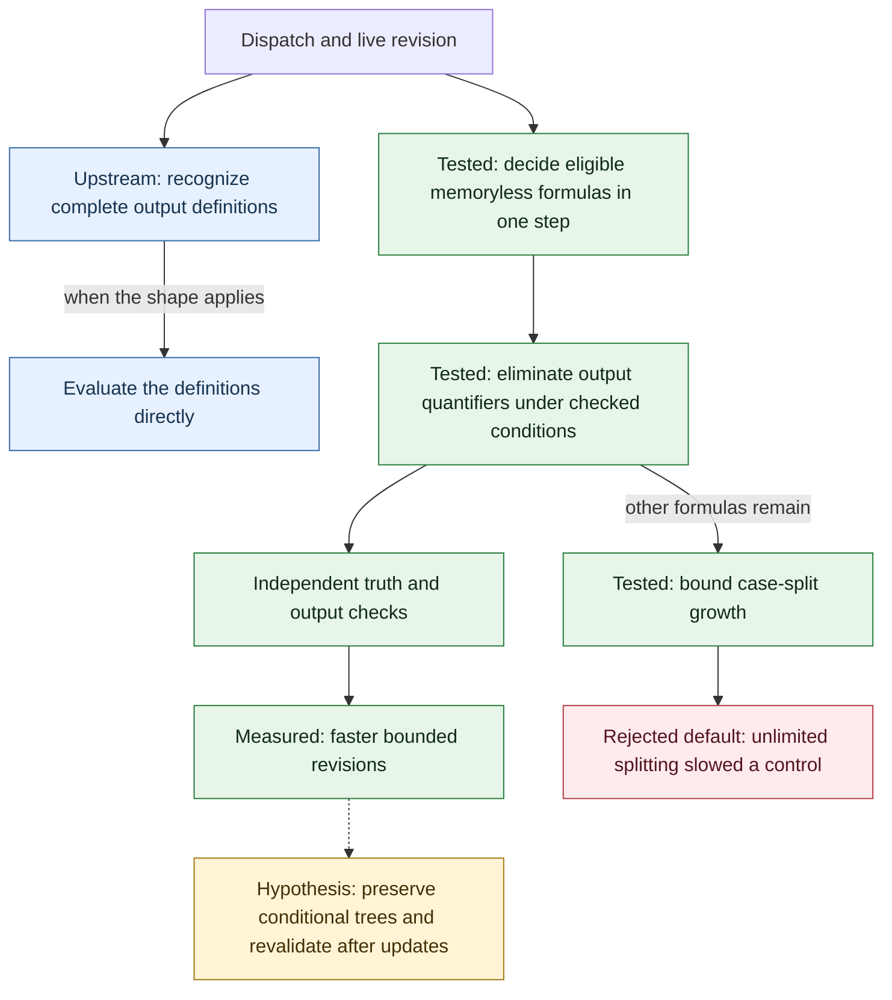
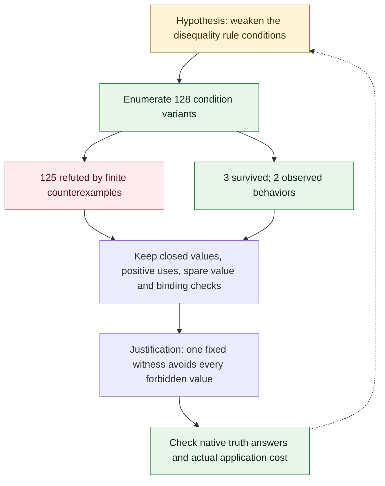

# Dispatch and revision: evidence and open questions

This map concerns the bounded dispatch and revision examples from [issue #203](https://github.com/IDNI/tau-lang/issues/203). A tested result applies to the named inputs, source revision and configuration. It is not a claim that every Tau program becomes faster.

The first map separates the locally tested changes from the upstream functional route. They have not been combined. Green nodes have local test evidence, red nodes record a rejected choice, yellow nodes remain hypotheses, and blue nodes refer to upstream work.

The structural group also includes solver coverage checks, bounded clause expansion and an early solver decision for closed formulas whose quantifiers are all of one kind. Those changes were measured together; their separate contributions have not been isolated.

The second map explains how the search constrains the rule. A surviving finite test bank is evidence for further checking, not a proof of global optimality. The witness argument below is an informal mathematical justification, not a machine-checked proof.

## Why the disequality rule is justified

Under the conditions below, the identity is:

**(∃x ∈ V s.t. P(x ≠ c₁, …, x ≠ cₖ)) ≡ P(⊤, …, ⊤), provided k < |V|.**

Notation: how to read the formulas

| Symbol | Meaning |
| --- | --- |
| `∀x ∈ V: Q` | For every value `x` in `V`, statement `Q` holds |
| `∃x ∈ V s.t. Q` | There is at least one value `x` in `V` for which `Q` holds |
| `s.t.` | Such that; introduces the condition on an existentially quantified value |
| `:` after a universally quantified variable | Separates “for every” from the statement that must hold |
| `∧`, `∨`, `¬` | And, or, not |
| `=`, `≠` | Equal, not equal |
| `≡` | The two formulas have the same truth value for every permitted assignment |
| `⊤`, `⊥` | True, false |
| `∈`, `\|V\|` | Belongs to a set; the number of values in the finite set `V` |
| `c₁, …, cₖ` | The listed forbidden values; `k` is their number |
| `P(…)` | A formula built from the displayed tests; here it must use them positively |

A dot after a quantified variable is a scope separator. After `∃`, it can be read as “such that”; after `∀`, read it as “for every …, the following holds.” This explanation uses `s.t.` with `∃` and a colon with `∀`. These are mathematical formulas. Literal Tau code uses `all` and `ex`, with Tau's own punctuation and operators; a final period in a Tau specification terminates the specification.

Let `x` range over a finite domain `V`. Suppose every occurrence of `x` is a positive test `x ≠ c`, each `c` is a closed value, and fewer than `|V|` values are forbidden. There is one value outside that finite set. Choosing it makes all those tests true at once. Since the surrounding formula only uses the tests positively, replacing them by true is exact under the existential quantifier. That same witness works through quantifiers over other variables because the forbidden values do not depend on those variables. For example, an 8-bit value can avoid both 0 and 1 by taking the value 2. There is no need to expand every combination of the other inputs to establish that fact.

| Condition | Witness showing why it matters | Decision |
| --- | --- | --- |
| A spare value exists | Over `V = {0,1}`, `∃x ∈ V s.t. (x ≠ 0 ∧ x ≠ 1)` is false | Reject the rule when every value may be excluded |
| Forbidden values are closed | `∃x ∈ V s.t. ∀y ∈ V: x ≠ y` is false for every nonempty `V` | Do not turn variable-dependent exclusions into true |
| Uses are positive | Over `V = {0,1}`, `∃x ∈ V s.t. ¬(x ≠ 0)` is true; replacing the test by `⊤` makes it false | Reject negated uses |
| Bindings are respected | An inner binder can introduce a different variable with the same spelling | Check variable identity and decline genuine shadowing |
| Each optimization has its own applicability test | A failed search for an equation defining `x` says nothing about a separate disequality identity | Try the separate rule before the failed-definition cache |

The condition search supplies counterexamples to unsound variants. It does not prove a globally optimal rule set or discover a new mathematical identity. Three variants survived the retained finite bank, representing two observed behaviors.

## Evidence boundaries

- For the 12-term revision example, median total CPU was 8.099730 s with the growth guard, 0.281225 s after adding the one-step decision, and 0.243497 s with the combined candidate. This is 33.3 times faster overall; the structural changes add 1.15 times beyond the one-step decision. Three repetitions include process setup, revision and the supplied steps. They do not isolate warm-step cost.
- The component comparison retains all 63 attempts and 1,809 checked outputs. Most of the flat-revision gain comes from the one-step decision. Repeated-step totals changed little; this is not evidence of a general execution speedup.
- The public command check enumerates 66,318 finite assignments for 414 formulas at bit widths 1, 2 and 3. Fresh sessions prevent type declarations from leaking between widths.
- The constant-top experiment returned the same answers in the growth-only and combined builds. Its initial expected values assumed the public trace-validity contract also applied internally. The source documents a different treatment of inputs, so those differences alone are not evidence of a new regression. The constant-top interpretation remains unresolved.
- Direct native checks accepted 718 decisions with the expected answers and declined 110 formula shapes. Seven additional unsupported categories fell back as required. All 414 compared decision rows matched the earlier implementation. These finite checks do not establish every internal entry-point equivalence.
- All 172 native tests passed across the initial run and a targeted retry. The initial build-setup step timed out during a metadata-triggered rebuild, leaving 41 tests unstarted; those 41 and one rebuilt interpreter test passed on retry. Both changed command tests also passed. The original timeout is retained. Other algebra configurations, functional-path composition and broader applications remain open.

The first branch follows @taumorrow’s approach: recognize output definitions before normalization obscures their structure ([#175](https://github.com/IDNI/tau-lang/pull/175)), then evaluate those definitions directly ([#179](https://github.com/IDNI/tau-lang/pull/179)). Thank you for helping clarify where we can avoid solver work altogether. Testing those proposals together with this candidate remains a separate step.
