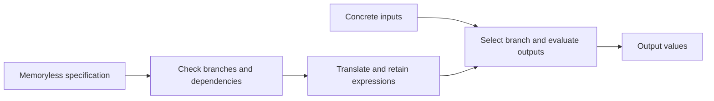

# Retained evaluation of a concrete VM step

This experiment loads a supported, memoryless bit-vector specification once,
checks its conditional branches and output dependencies, and retains an
evaluator for subsequent concrete inputs. It is an opt-in prototype.

The patch is based on Tau `15d091723f2b17175bc41f9a9ab6fb5a7760751f`, with parser
`5b14b6fde86f16dc52c4c0a953a8a1e53c88f95a`. It changes the concrete evaluation
path and its admission checks. The ordinary satisfiability implementation is
unchanged. The experimental command is `evalspec`; set `TAU_CONCRETE_EVAL=1`
to enable it. Unsupported specifications return a diagnostic. The API's
ordinary solve operation can fall back to its existing solver.

## Build and small check

Requirements: Git, a recent CMake (tested with 4.1.1), Python 3.9 or newer, and a C++23
compiler. Follow [Tau's source build instructions](https://github.com/IDNI/tau-lang/blob/15d091723f2b17175bc41f9a9ab6fb5a7760751f/README.md) for cvc5 and Boost. The complete
upstream suite additionally needs Spot (`ltlsynt`, `autfilt`, `ltlfilt`).
Allow several GiB of memory for the VM example, plus compiler memory.

From this directory, choose a new checkout directory and run:

```sh
git clone https://github.com/IDNI/tau-lang.git tau-source
git -C tau-source checkout 15d091723f2b17175bc41f9a9ab6fb5a7760751f
git -C tau-source submodule update --init external/parser
git -C tau-source apply ../retained-evaluator.patch
```

On Linux, build with the installed C++23 compiler:

```sh
cd tau-source
./dev preset release-tests -DTAU_BAS=sbf,tau,qint,qlt,bv -DTAU_BUILD_JOBS=4 -DTAU_LTO=OFF
cd ..
```

On macOS, also apply `macos-enum-names.patch` before building. This separate
portability correction is described in Tau issue #193. It is unrelated to
retained evaluation. Select your installed C++23 compiler with CMake's compiler
options if the system compiler is older. The exact measured build settings
and platform differences are recorded with the observations.

For the measured macOS setup, apply that correction and build as follows:

```sh
git -C tau-source apply ../macos-enum-names.patch
cd tau-source
./dev preset release-tests -DTAU_BAS=sbf,tau,qint,qlt,bv -DTAU_BUILD_JOBS=6 \
  -DTAU_LTO=OFF \
  -DCMAKE_C_COMPILER="$(brew --prefix llvm)/bin/clang" \
  -DCMAKE_CXX_COMPILER="$(brew --prefix llvm)/bin/clang++" \
  -DCVC5_DIR="$HOME/.tau/cvc5/dist/lib/cmake/cvc5" \
  -DCMAKE_EXE_LINKER_FLAGS="-L$(brew --prefix icu4c)/lib"
cd ..
```

Either build can run the focused evaluator checks:

```sh
ctest --test-dir tau-source/build/release -R 'evalspec|concrete_eval' --output-on-failure
```

Some upstream generated-code tests invoke `g++` directly. On the measured Mac,
the system command could not find C++ headers, and the Homebrew compiler's
default SDK path did not exist. A local wrapper selected the installed SDK;
no system files or Tau sources were changed. Before running the complete
suite, from this package directory:

```sh
mkdir -p test-tools
cat > test-tools/g++ <<'SH'
#!/bin/sh
exec "$(brew --prefix llvm)/bin/clang++" -isysroot "$(xcrun --show-sdk-path)" "$@"
SH
chmod +x test-tools/g++
export PATH="$(pwd)/test-tools:$PATH"
export LIBRARY_PATH="$(brew --prefix icu4c)/lib${LIBRARY_PATH:+:$LIBRARY_PATH}"
export CC="$(brew --prefix llvm)/bin/clang"
export CXX="$(brew --prefix llvm)/bin/clang++"
```

For a tiny example, launch Tau with the switch enabled:

```sh
TAU_CONCRETE_EVAL=1 tau-source/build/release/tau --charvar false -c false
```

Enter one command per line:

```text
always o1[t]:bv[2] = (i1[t]:bv[2] + i2[t]:bv[2]).
evalspec %1
evalspec %1 3 2
evalspec %1 0 0
evalspec %1 1 2
q
```

The three output values are 1, 0 and 3. Addition wraps modulo 4. Each evaluation
returns an `evalspec-result:` line with `status=ok`, followed by `evalspec-end`.
The first `evalspec %1` only admits the expression and describes its inputs.

To check that example automatically, including two invalid input values:

```sh
python3 check_example.py tau-source/build/release/tau --output example-results
```

The script checks the response frames. In this REPL mode an error reply can
still accompany process exit 0, so the exit code alone is insufficient.

For all configured upstream tests, with the evaluator switch disabled and
enabled in the ambient environment:

```sh
TAU_CONCRETE_EVAL=0 ctest --test-dir tau-source/build/release -j 4 --output-on-failure
TAU_CONCRETE_EVAL=1 ctest --test-dir tau-source/build/release -j 4 --output-on-failure
```

Tests that explicitly set their own switch keep that setting. These commands
preserve upstream's default list of 19 excluded C++ test executables. Internal
skips within successful executables are counted separately in the saved
validation record. No additional exclusions are used.

## VM replay

```sh
python3 replay.py tau-source/build/release/tau --output my-results
```

The output directory must be new. The default run performs five alternating
repeats of a 55-transition workload per version, followed by 256 distinct
saved input vectors per version. Each output is checked against the separate
Python expression model before the next transition. `--repeats 1 --count 16`
is a shorter smoke run; it does not repeat the full experiment. Linux users
can choose a CPU with `--cpu N`. Run timing separately from compilation or
other heavy work.

The workloads comprise a three-step arithmetic program, a 17-step illustrative
payroll program with synthetic data, and 35 conformance vectors. The 256
additional vectors contain 56 cases for which the VM model returns its fault
output. They are ordinary VM input cases, not crashes of Tau. The additional
vectors are separate valuations, not one long feedback trace.

The two compared adapters do different amounts of work:

- **Ordinary:** keeps one Tau process, loads the definitions once, and asks Tau
  to choose a conditional branch and then solve its output terms. It caches
  closed function calls after asking Tau to evaluate them. The 21 outputs are
  packed into one 672-bit result and decoded by the adapter.
- **Retained:** loads the full specification, admits its evaluator, then sends
  the concrete input values in one `evalspec` request per step. Tau computes
  the branch and all outputs through its bit-vector operations.

The measured step interval includes the Python adapter, query construction,
pipe communication and result decoding. It is a comparison of these complete
execution paths, not an isolated solver-kernel measurement and not a comparison
with Tau's general temporal interpreter. The model and result validation are
outside the timed interval. Setup time is reported separately and also included
in the overall 256-input comparison. RSS readings are process samples, not
lifetime peaks or bounds on memory.

## Evidence scope

The recorded evaluator-only replay checked 531 transitions per version: five
repeats of 55 transitions plus 256 additional saved input vectors. All output
tuples matched the Python model.

| Measurement | Ordinary adapter | Retained adapter |
| --- | ---: | ---: |
| Median of five per-run step medians | 248.673 ms | 0.939 ms |
| Range of those five medians | 244.031–249.893 ms | 0.926–0.996 ms |
| Median setup | 0.518 s | 8.276 s |
| 256 distinct inputs, setup plus measured steps | 65.121 s | 8.639 s |
| Median sampled RSS after 55 transitions | 195.3 MiB | 2,567.1 MiB |

The repeated-step ratio is **264.8×**; the setup-inclusive 256-input ratio is
**7.54×**. These measurements use an Apple M3 Max, macOS 26.6.2, Python 3.9.6,
Clang 22.1.2, Release, LTO off, without CPU pinning. Builds and regression tests
finished before timing began. They are observations for this VM and protocol,
not a language-wide performance guarantee.

The retained process already used about 2.50 GiB after loading the full
specification. Median loading time was 7.805 s and admission was 0.234 s.
Those samples locate the main setup cost before repeated evaluation; they
do not measure lifetime peak memory. Short runs may be slower overall.

Both ambient switch settings ran all 2,398 configured CTest entries:
**2,395 passed and three failed** in each. The three failures require a
particular printed ordering. The unmodified source with the same macOS enum
correction produces the same failures and identical formulas, including
`b != a` where a test expects `a != b`. No test was edited or excluded to hide
them. Each full run also contains 12 skipped cases inside successful test
executables, separate from the 19 executables upstream excludes by default.

The default algebra selection passed 19 focused checks, the `sbf,tau,bv`
selection passed 18, and `sbf,tau,qint` passed seven, including the `no_backend`
response. These additional selections have build and focused-check evidence;
they were not each given the full suite. The nine API cases include exhaustive
width-1–3 comparisons with the ordinary solver; the VM comparison uses the
separate Python model. Neither establishes correctness for arbitrary programs.

`recorded/build.json` identifies the exact patch, executable and dependencies.
`recorded/validation.json` and the two suite JSON files preserve test counts,
failures, internal skips and the stock comparison. Output tuples and timing
measurements are retained without rounding in `recorded/evaluator-only-results.json`.
To check the saved answers, counts, hashes and timing arithmetic without Tau:

```sh
python3 verify_saved.py
```

The VM
source and expression model match the original benchmark's recorded hashes.
The replay adapters retain the computation protocol and add a macOS RSS reader
and an explicit version pin; an unused compatibility decoder is omitted.
The driver uses saved programs and vectors,
avoiding a dependency on a separate repository.

The VM source and model retain their accompanying license in `vm/LICENSE`.
Obtain Tau separately under its upstream license.

The admission count limits the accepted expression representation. It is not
a limit on parser memory or a time guarantee. The patch includes an exact
boundary check: one less than the needed count declines; the exact count and
one above it admit and return the expected value.

## How the repeated work is removed

Admission first checks that each conditional branch defines every output and
that output dependencies have no cycle. The bit-vector backend then translates
the branch selector and output expressions into cvc5 terms once. For a later
input it substitutes concrete values, simplifies the selector, and evaluates
only the selected branch's outputs in dependency order. Translation uses Tau's
existing bit-vector translator and simplifier.

The input protocol and this retained representation are the experiment. The
application supplies the VM's state as ordinary inputs and feeds results into
the next call; the evaluator itself does not add temporal state to Tau.



Thank you @taumorrow for the related functional-step work in
[Tau #178](https://github.com/IDNI/tau-lang/issues/178) and
[PR #179](https://github.com/IDNI/tau-lang/pull/179). That work integrates
functional evaluation into the temporal interpreter. This experiment retains
a separate evaluator for memoryless specifications; it does not measure that
PR or establish that a separate public command is the best integration.
